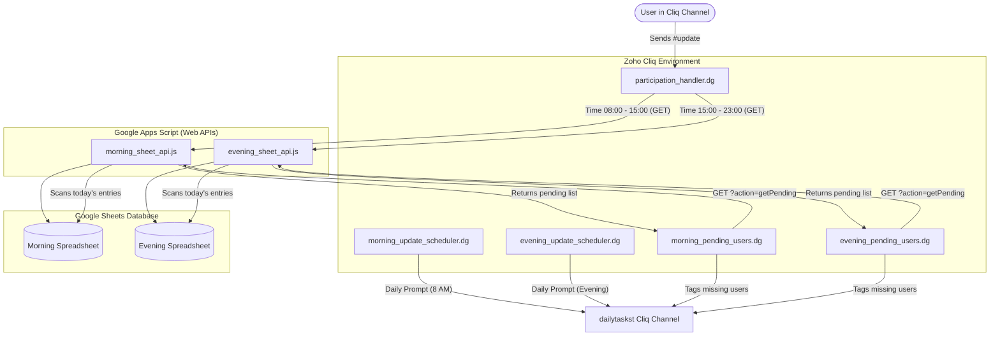

# Zoho Cliq Task Tracker Bot 🤖

This repository contains the source code for a Zoho Cliq integration that tracks team tasks. The system consists of **Zoho Cliq Deluge Handler & Schedulers** and **Google Apps Script Web APIs** that interface with Google Sheets.

---

## 🗺️ System Architecture & Workflow

Here is how the components interact:

---

## 📁 File Descriptions & How They Work

### 1. Zoho Cliq Deluge Code

*   **[participation_handler.dg](file:///c:/Users/chand/OneDrive/Desktop/Zoho Bot/participation_handler.dg)**
    *   **Trigger**: Configured in Zoho Cliq as a channel/message handler or bot participation handler.
    *   **Logic**:
        1. Checks if the incoming message starts with `#update`.
        2. Sanitizes the message to extract the actual task description.
        3. Retrieves the user's name and ID.
        4. Validates the current time:
            *   **8:00 AM – 3:00 PM**: Routes the update to the Morning Google Sheet API.
            *   **3:00 PM – 11:00 PM**: Routes the update to the Evening Google Sheet API.
            *   **Other times**: Responds with an error message restricting updates to working hours.
        5. Calls the corresponding Apps Script URL and sends a success confirmation back to the Cliq user.

*   **[morning_update_scheduler.dg](file:///c:/Users/chand/OneDrive/Desktop/Zoho Bot/morning_update_scheduler.dg) & [evening_update_scheduler.dg](file:///c:/Users/chand/OneDrive/Desktop/Zoho Bot/evening_update_scheduler.dg)**
    *   **Trigger**: Scheduled to run daily (e.g., 8:00 AM and 6:00 PM) except Sundays.
    *   **Logic**: Sends a standard greeting to the Cliq channel (`dailytaskst`) asking the team to log their morning plans or completed evening tasks.

*   **[morning_pending_users.dg](file:///c:/Users/chand/OneDrive/Desktop/Zoho Bot/morning_pending_users.dg) & [evening_pending_users.dg](file:///c:/Users/chand/OneDrive/Desktop/Zoho Bot/evening_pending_users.dg)**
    *   **Trigger**: Scheduled to run near the end of the submission windows.
    *   **Logic**:
        1. Calls the corresponding Apps Script Web App URL with `?action=getPending`.
        2. Receives a list of users who have not submitted their tasks yet.
        3. If there are pending users, it tags them in the channel (e.g., `<@Chandan>`) urging them to update.
        4. If everyone has completed their tasks, it posts a celebration message.

---

### 2. Google Apps Script Web Apps

*   **[morning_sheet_api.js](file:///c:/Users/chand/OneDrive/Desktop/Zoho Bot/morning_sheet_api.js) & [evening_sheet_api.js](file:///c:/Users/chand/OneDrive/Desktop/Zoho Bot/evening_sheet_api.js)**
    *   **Deployed as**: Web Apps (accessible to "Anyone" with executing authority).
    *   **Spreadsheet Management**:
        *   Automatically checks if a sheet for the current month exists (formatted as `YYYY-MM`). If not, it creates a new tab with headers (`UserID`, `Name`, `Task`, `Date`).
        *   Appends a day divider header (e.g., `--- NEW DAY [Date] ---`) when a new day's first entry is logged.
    *   **Endpoint Routing (`doGet`)**:
        *   **Standard GET**: Logs a task submission. Reads parameter inputs (`user_id`, `user_name`, `task`) and writes a new row to the sheet.
        *   **`action=getPending` GET**: Scans today's logged entries in the spreadsheet, determines who has already submitted, compares it against the master `allUsers` list, and returns a JSON array of missing users.

---

## 🚀 Setup & Configuration Instructions

### Step 1: Set up the Google Spreadsheets
1. Create two separate Google Spreadsheets: one for **Morning Updates** and one for **Evening Updates**.
2. Copy the Spreadsheet ID from the URL bar of each spreadsheet:
   `https://docs.google.com/spreadsheets/d/SPREADSHEET_ID/edit`

### Step 2: Deploy Google Apps Scripts
1. Open Google Sheets -> Extensions -> **Apps Script**.
2. Paste the code from [morning_sheet_api.js](file:///c:/Users/chand/OneDrive/Desktop/Zoho%20Bot/morning_sheet_api.js) into the morning spreadsheet's Apps Script editor.
3. Paste the code from [evening_sheet_api.js](file:///c:/Users/chand/OneDrive/Desktop/Zoho%20Bot/evening_sheet_api.js) into the evening spreadsheet's Apps Script editor.
4. Customize the variables in both scripts:
    *   Replace `YOUR_SPREADSHEET_ID` with the actual sheet ID from Step 1.
    *   Populate the `allUsers` array with your team's Cliq IDs and names.
5. Deploy each script as a Web App:
    *   Click **Deploy** -> **New deployment**.
    *   Select **Web app**.
    *   Execute as: **Me**.
    *   Who has access: **Anyone**.
    *   Deploy and copy the Web App URL.

### Step 3: Configure Zoho Cliq Schedulers and Handlers
1. Open the Zoho Cliq Developer console.
2. Under **Message Handlers** (or your Bot participation settings), implement the logic from [participation_handler.dg](file:///c:/Users/chand/OneDrive/Desktop/Zoho%20Bot/participation_handler.dg).
    *   Paste your morning and evening Apps Script Web App URLs into `morning_url` and `evening_url`.
3. Create 4 **Schedulers** in Zoho Cliq:
    *   **Morning Broadcast**: Paste code from [morning_update_scheduler.dg](file:///c:/Users/chand/OneDrive/Desktop/Zoho%20Bot/morning_update_scheduler.dg) (runs daily at e.g. 8:30 AM).
    *   **Morning Pending Reminder**: Paste code from [morning_pending_users.dg](file:///c:/Users/chand/OneDrive/Desktop/Zoho%20Bot/morning_pending_users.dg) (runs daily at e.g. 11:30 AM).
    *   **Evening Broadcast**: Paste code from [evening_update_scheduler.dg](file:///c:/Users/chand/OneDrive/Desktop/Zoho%20Bot/evening_update_scheduler.dg) (runs daily at e.g. 5:30 PM).
    *   **Evening Pending Reminder**: Paste code from [evening_pending_users.dg](file:///c:/Users/chand/OneDrive/Desktop/Zoho%20Bot/evening_pending_users.dg) (runs daily at e.g. 8:30 PM).
